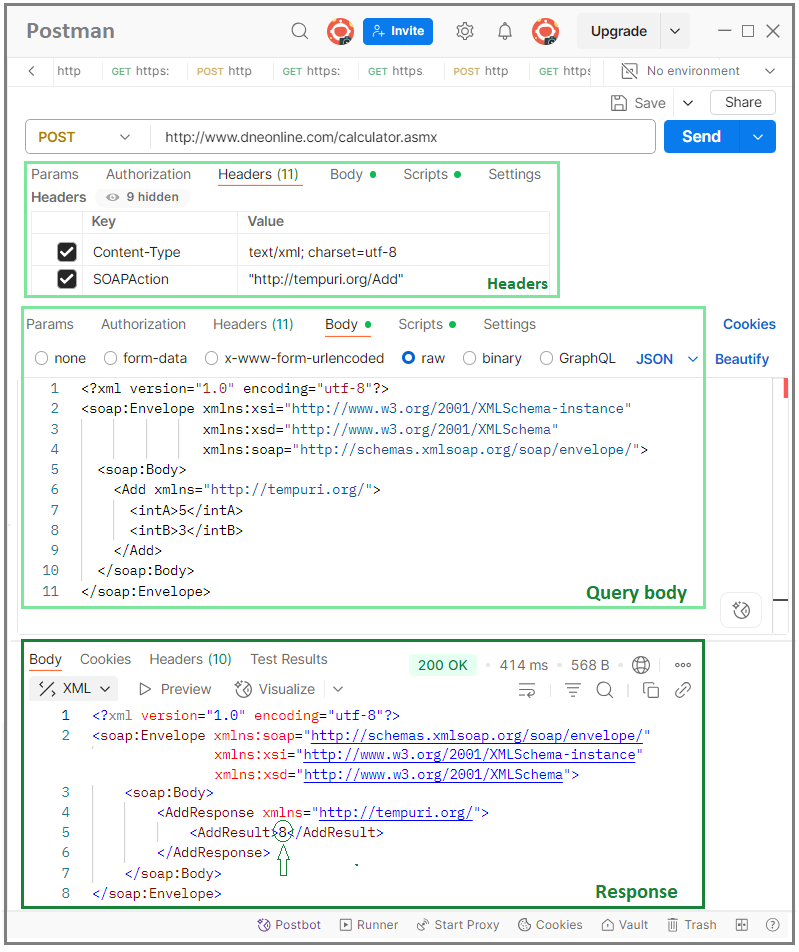

# Simple SOAP Example (.NET + Postman)

## 🔹 Overview What is SOAP?

SOAP (Simple Object Access Protocol) is a protocol for exchanging structured data between systems over HTTP.  
It was commonly used before REST became popular.

### Key facts:
- XML-based messaging
- Uses **envelopes** to wrap data
- Often requires **tokens** or security headers
- Still used in banking, government, and enterprise systems
- Works well with **.NET Framework**
- Services are described by **WSDL** files
- Heavier and more formal than REST

---

## ⚙️ Example 1 – .NET Framework Console App

### ✅ Setup:
1. Create a new `.NET Framework Console App` in Visual Studio
2. Use a Service Reference: `http://www.dneonline.com/calculator.asmx?WSDL`

### Code:

```csharp
using System;
using SoapApi481.CalcService;

class Program
{
    static void Main()
    {
        var client = new CalculatorSoapClient();
        int result = client.Add(5, 3);
        Console.WriteLine($"5 + 3 = {result}");
    }
}
````

### ✅ Description

After adding the *Service Reference*, Visual Studio generates classes that handle SOAP communication. A SOAP client class is created, which uses the HTTP protocol and contains methods for sending and receiving SOAP requests.

The `Add(5, 3)` method sends data to the public service at `dneonline.com`. No token is needed for this example. The method automatically wraps the request in a SOAP envelope, as required by the protocol.

The service responds with XML in the SOAP format. The `Add(5, 3)` method reads the XML and extracts the result (`8`), returning it as an integer.

In this way, the complexity of SOAP is hidden inside the generated client class. The programmer uses simple and readable methods like `Add`, `Subtract`, etc.


---

## ⚙️ Example 2 – Using Postman

When using Postman, communication is done in the same way as described above 
in the program. However, here, explicit commands and structures are used that 
SOAP requires. Below is a list of necessary entries for the query and the 
form of the response that is received in XML format.

### ✅ Endpoint:

```
POST http://www.dneonline.com/calculator.asmx
```

### ✅ Headers:

| Key          | Value                                              |
| ------------ | -------------------------------------------------- |
| Content-Type | text/xml; charset=utf-8                            |
| SOAPAction   | "[http://tempuri.org/Add](http://tempuri.org/Add)" |

### ✅ Request Body (raw → XML):

```xml
<?xml version="1.0" encoding="utf-8"?>
<soap:Envelope xmlns:xsi="http://www.w3.org/2001/XMLSchema-instance"
               xmlns:xsd="http://www.w3.org/2001/XMLSchema"
               xmlns:soap="http://schemas.xmlsoap.org/soap/envelope/">
  <soap:Body>
    <Add xmlns="http://tempuri.org/">
      <intA>5</intA>
      <intB>3</intB>
    </Add>
  </soap:Body>
</soap:Envelope>
```

### ✅ Response:

```xml
<?xml version="1.0" encoding="utf-8"?>
<soap:Envelope xmlns:soap="http://schemas.xmlsoap.org/soap/envelope/" 
               xmlns:xsi="http://www.w3.org/2001/XMLSchema-instance" 
               xmlns:xsd="http://www.w3.org/2001/XMLSchema">
  <soap:Body>
    <AddResponse xmlns="http://tempuri.org/">
      <AddResult>8</AddResult>
    </AddResponse>
  </soap:Body>
</soap:Envelope>
```





---

## 🔹 Summary
This example shows that SOAP can be used easily in both code and tools like Postman.


